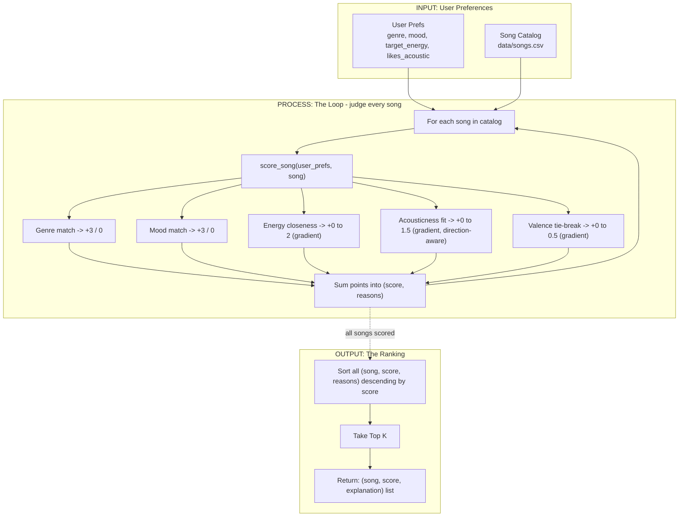

# Visual Design: Recommendation Data Flow

This sketches the data flow for the recommender's "Algorithm Recipe" scoring logic, before writing the implementation in `src/recommender.py`. The full diagram lives in [visualdesign.mmd](visualdesign.mmd); it's reproduced inline below for renderers that support Mermaid. This is a design draft only - no scoring code lives in this file.

## Input -> Process -> Output

- **Input (User Prefs):** a dict of the listener's stated preferences - `genre`, `mood`, `target_energy`, `likes_acoustic` - plus the full song catalog loaded from `data/songs.csv`.
- **Process (the loop):** every song in the catalog is judged independently by `score_song(user_prefs, song)`, which adds up points from five weighted terms and collects a human-readable reason for each one.
- **Output (the ranking):** once every song has a `(score, reasons)` pair, the full list is sorted descending by score and truncated to the top `K`, returned as `(song, score, explanation)` tuples.

## Point-weighting recap (10-point scale)

| Feature | Max pts | Shape |
|---|---|---|
| Genre | 3 | binary exact match |
| Mood | 3 | binary exact match |
| Energy | 2 | gradient: `2 * (1 - abs(target - actual))` |
| Acousticness | 1.5 | gradient, direction-aware on `likes_acoustic` |
| Valence | 0.5 | gradient tie-breaker |

Genre and mood dominate because they're categorical signals of "is this even the right kind of song." Energy and acousticness are continuous, so they're scored on a gradient to reward near matches instead of an all-or-nothing cutoff. Valence is a low-weight tie-breaker since it isn't an explicit preference field.

## Diagram

The dashed edge (`SUM -.-> F`) marks the loop-exit condition - once all songs are scored, control passes from the Process stage into the Output stage's ranking step.

This is documentation only - it has no effect on runtime behavior. Keep it in sync with the actual formula in `src/recommender.py::score_song` if the weights change later.
